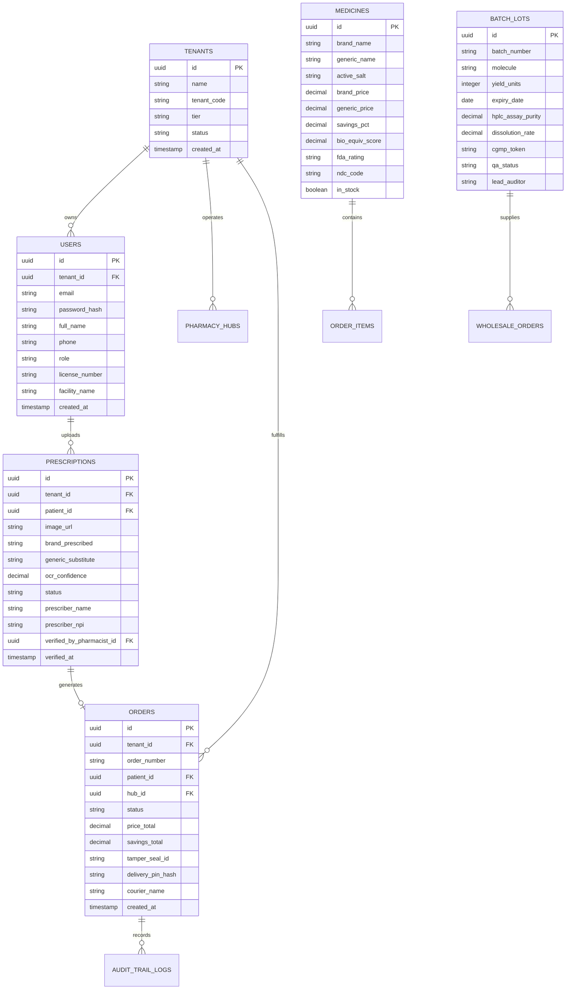

# Project Long-Term Memory
## GenericMed Enterprise & Multi-Tenant Platform

> **Document control:** Update this memory whenever a durable fact changes (architecture, endpoint contract, schema, feature state, risk, or roadmap). Keep observed implementation facts separate from planned work, and link material choices to `decisions.md`.

This document serves as the **authoritative, persistent institutional memory** for the GenericMed project. It preserves system architecture, completed features, pending initiatives, API contracts, database schemas, core business logic, known edge cases, and future roadmaps for AI coding assistants and engineering teams.

---

## 1. Project Overview

### 1.1 Executive Summary
**GenericMed** is a high-performance, multi-tenant healthcare technology platform engineered to eliminate predatory pharmaceutical pricing by democratizing access to FDA-approved generic medicines. The platform unites four key stakeholders:
1. **Patients & Consumers**: Search originator brands, discover 70–90% cheaper bio-equivalent generics, scan paper prescriptions via AI OCR, and track express 35-minute doorstep delivery.
2. **Licensed Retail Pharmacies**: Receive verified prescription orders, validate NDC barcodes, pack tamper-evident security parcels, and dispatch couriers.
3. **Pharmaceutical Manufacturers**: Publish cGMP-certified batch dossiers, HPLC purity assay results, and wholesale bulk inventories directly to licensed hubs.
4. **Enterprise Healthcare Operators & Regulators**: Supervise multi-tenant operations, audit clinical prescription substitutions, inspect FDA compliance trails, and monitor gross merchandise volume (GMV).

### 1.2 Core Value Propositions
- **Radical Price Transparency**: Calculates instant savings between originator brands (e.g., Lipitor @ $98.50) and AB-rated generic substitutes (e.g., Atorvastatin @ $14.20) providing up to 85.6% cost reduction.
- **AI-Powered Clinical Safety**: Dual-stage prescription OCR with Google Cloud Vision coupled with licensed pharmacist digital sign-off.
- **Hyperlocal 35-Minute Express Fulfillment**: Geofenced routing to the nearest neighborhood pharmacy hub with serialized tamper-evident security tape (`GM-SEAL-88219-BK`) and 4-digit doorstep delivery PIN authentication (`8410`).
- **End-to-End Supply Chain Traceability**: Cryptographic batch tokens and lab assay verification linking wholesale manufacturer reactors to patient pill bottles.

---

## 2. Technology Stack

### Repository Layout (v1.8.0)
- `frontend/` is the standalone React/Vite browser application. Its API client reads `VITE_API_GATEWAY_URL` from `frontend/.env`; it contains no backend source imports.
- `backend/` is the standalone service workspace. PostgreSQL migrations, Nginx gateway configuration, and Go/Python/Node microservices live under `backend/src/`; `backend/package.json` provides service build/start scripts and `backend/.env` contains server-only variables.

```
                                  [ Users & Clients ]
                  (Patients • Pharmacists • Manufacturers • Enterprise Admins)
                                           │
                                           ▼
                             [ Cloudflare Edge CDN & WAF ]
                                 (TLS 1.3 • DDoS • Geo)
                                           │
                                           ▼
                              [ Kong Enterprise Gateway ]
                                  (OAuth2 JWT • RBAC)
                                           │
             ┌─────────────────────────────┼─────────────────────────────┐
             ▼                             ▼                             ▼
    [ Medicine Catalog Svc ]      [ Prescription OCR Svc ]      [ Order & Dispatch Svc ]
     (Go • gRPC • Port 50051)      (Python FastAPI • PyTorch)    (Node.js / TS • Kafka)
             │                             │                             │
             ├─────────────────────────────┼─────────────────────────────┘
             ▼                             ▼
   [ PostgreSQL 16 Cluster ]       [ Redis 7.2 Cluster ]        [ Elasticsearch 8.11 ]
   (Row-Level Security / RLS)      (Cache & GPS Telemetry)      (Salt Fuzzy Tokenizer)
```

| Domain | Technology / Library | Version | Role in Architecture |
| :--- | :--- | :--- | :--- |
| **Frontend Framework** | React | `19.0.0` | High-performance reactive user interface |
| **Language** | TypeScript | `5.6+` | Strict static type checking and domain modeling |
| **Styling & Design** | Tailwind CSS | `v4` | Design token system, responsive utility styling |
| **Icons & Assets** | Lucide React + Material Symbols | Latest | System iconography and clinical indicators |
| **Typography** | Plus Jakarta Sans / Inter / JetBrains Mono | Google Fonts | Display headings, body text, and technical codes |
| **Build Tooling** | Vite | `6.0+` | Lightning-fast ESM bundling and development server |
| **Edge & API Gateway** | Cloudflare WAF + Kong Enterprise | `3.6+` | Zero-trust authentication, rate-limiting, edge proxy |
| **Catalog Microservice**| Go / gRPC | `1.22+` | High-throughput salt-matching & bio-equivalence |
| **OCR & NLP Microservice**| Python / FastAPI / Cloud Vision | `3.11+` | Prescription image preprocessing & entity extraction |
| **Order & Event Stream**| Node.js / TypeScript / Apache Kafka| `20 LTS` | Real-time event streaming & courier routing |
| **Primary Database** | PostgreSQL | `16.2` | Relational store with multi-tenant Row-Level Security |
| **Cache & Real-Time** | Redis Cluster | `7.2` | Hot catalog caching, rate tokens, courier telemetry |
| **Search Engine** | Elasticsearch | `8.11` | Chemical salt tokenizer & phonetic brand search |

---

## 3. Features Completed (Current State)

### Phase 4 Foundations (In Progress - v1.5.0)
- `backend/src/services/fda-sync/` contains the FDA Orange Book ingestion worker. It validates the official ZIP structure, normalizes Products/Patent/Exclusivity data, calculates deterministic snapshot diffs, and conditionally upserts into PostgreSQL when `DATABASE_URL` is supplied.
- `backend/src/db/04_phase4_compliance.sql` adds `fda_sync_runs` and `fda_orange_book_products`, plus an append-only, per-ledger-scope SHA-256 audit chain. Database triggers reject audit record updates and deletes.
- The OCR verification endpoint signs `prescription_id | pharmacist_license | UTC timestamp` with SHA-256 and records minimal decision metadata; it does not include patient identifiers in audit details.

### Phase 5 Foundations (In Progress - v1.6.0)
- Payment endpoints in the order service accept only tokenized `pm_` payment-method IDs and calculate an 8.5% platform fee with explicit hub and courier allocations. Default `PAYMENTS_MODE=demo` performs no external charge.
- Insurance quotes are estimates by default and are clearly labeled in the customer catalog. `CLEARINGHOUSE_MODE=live` is configuration-gated pending a contracted clearinghouse integration; no raw EDI payload or member identifier is stored.
- `backend/src/db/05_phase5_payments.sql` adds payment transactions, settlements, insurance quotes, and 30/90-day refill subscription records.

### Phase 6 Foundations (In Progress - v1.7.0)
- `POST /api/v1/wholesale/purchase-orders` reserves in-memory released batch inventory, selects a purchase tier (1k+, 5k+, or 20k+ units), and emits a SHA-256-derived PO signature reference bound to the signer license and cGMP token. Production persistence is represented by `backend/src/db/06_phase6_marketplace_iot.sql`.
- `POST /api/v1/cold-chain/telemetry` validates shipment/device identity and puts the shipment in `quarantined` state for any temperature below 2°C or above 8°C. The manufacturer portal retains demo fallback behavior when services are unavailable.

The project currently contains **8 fully integrated production-ready interactive screens** and unified navigation infrastructure:

- [x] **Universal Navigation & Role Header (`src/components/NavigationHeader.tsx`)**:
  - Direct switching between all 8 platform screens with active badges and category tags.
  - Interactive Desktop/Mobile Frame Switcher simulating a native mobile device for consumer screens.
  - Global `⌘K` / `Ctrl+K` command search launcher.
  - User profile badge with active session indicators.
- [x] **Universal Screen Router & Toast Bus (`src/App.tsx`)**:
  - Centralized screen state routing (`currentScreen: ScreenId`).
  - Global floating toast notification system with auto-dismissal (4000ms).
  - Keyboard listener for `⌘K` and `ESC` hotkeys.
  - Global medicine search modal filtering brand, generic, and active salt names with instant navigation.
- [x] **Screen 1: Enterprise Gateway (`EnterpriseOpsScreen.tsx`)**:
  - Multi-tenant pharmacy matrix with live GMV, generic match rate (99.4%), and SLA dispatch metrics.
  - Clinical Prescription Verification Queue with side-by-side paper prescription pad inspector.
  - Pharmacist approval, digital signature sign-off, and one-click clinical substitution.
  - FDA cGMP audit log drawer and live platform revenue counters.
- [x] **Screen 2: Customer Search & Compare (`CustomerAppScreen.tsx`)**:
  - Interactive medicine search bar with instant fuzzy suggestions.
  - Side-by-side Price Comparison Cards (Brand vs Generic) displaying real-time dollar and percentage savings.
  - Bio-equivalence indicator pill (e.g. `99.4% AUC Match • AB Rated`).
  - Active salt breakdown, dosage instructions, and one-click cart checkout.
- [x] **Screen 3: Prescription OCR Scanner (`RxScannerScreen.tsx`)**:
  - Camera viewfinder simulation with animated scanline and boundary guides.
  - Real-time OCR entity extraction card showing extracted drug name, dosage, prescriber NPI, and confidence rating (99.1%).
  - One-click prescription submission to nearest licensed pharmacy hub.
- [x] **Screen 4: Live Order Tracking (`OrderTrackingScreen.tsx`)**:
  - Express 35-Minute fulfillment countdown timer.
  - Interactive simulated courier GPS map tracking Miguel S. on E-Cargo Bike #14.
  - Tamper-Evident Security Seal display (`GM-SEAL-88219-BK`).
  - Cryptographic 4-digit Doorstep Handover PIN (`8410`) with copy-to-clipboard action.
- [x] **Screen 5: Pharmacy Dispensing Workbench (`PharmacyPortalScreen.tsx`)**:
  - Live fulfillment queue for licensed dispensing pharmacists.
  - Barcode & NDC scanner simulator validating lot numbers (`#CP-9021`) and expiry dates.
  - Automated thermal packing slip and prescription label printing.
  - Courier handover bay checkout.
- [x] **Screen 6: Manufacturer cGMP Portal (`ManufacturerPortalScreen.tsx`)**:
  - Bulk production batch lot dossier inspector (`#CP-9021`, Atorvastatin Calcium 20mg, 45k units).
  - Chemical quality metrics: HPLC Assay purity (99.82%), Dissolution (96.4%), Residual Solvents (<0.001 ppm).
  - Verifiable cGMP cryptographic quality token (`cGMP Token #904-QA`).
  - B2B Wholesale Purchase Order allocation and cold-chain dispatch manifests.
- [x] **Screen 7: System Architecture Visualizer (`SystemArchitectureScreen.tsx`)**:
  - Interactive 4-layer architecture map: Client, Edge, Microservices, and Multi-Tenant Data Layer.
  - Live diagnostic inspector displaying service health, response latency, and tech stack details.
  - End-to-end user workflow simulators tracing workflows 1, 2, and 3 across microservice boundaries.
- [x] **Screen 8: Multi-Role Authentication & Account (`AuthScreen.tsx`)**:
  - Role-based authentication tabs supporting Patient, Pharmacist, Manufacturer, and Enterprise Admin personas.
  - Quick-switch one-click demo credentials for rapid stakeholder testing.
  - Full registration workflow with license and facility inputs.
  - User profile inspector with address, active prescription counts, and session termination.
- [x] **Canonical Domain Data & Types (`src/types.ts` & `src/data/mockData.ts`)**:
  - Fully typed domain entities: `MedicineItem`, `PrescriptionOrder`, `PharmacyHub`, `BatchLot`, `WholesaleOrder`, `UserProfile`.
  - Realistic medical datasets mirroring real-world pharmaceutical standards (Lipitor, Augmentin, Glucophage, Crestor, Prilosec).

---

## 4. Pending Features & Engineering Backlog

- [ ] **Live Backend Microservices Connectivity**:
  - Replace mock client data with live HTTP/REST and gRPC-web connections to backend microservices.
  - Wire Kong API Gateway with JWT session tokens.
- [ ] **Real-Time Courier Telemetry via WebSockets / SSE**:
  - Connect `OrderTrackingScreen` to a Redis Pub/Sub stream broadcasting real-time courier GPS coordinates.
- [ ] **Hardware Camera MediaDevices Integration**:
  - Upgrade `RxScannerScreen` from simulation mode to HTML5 `navigator.mediaDevices.getUserMedia()` for real smartphone cameras with fallback upload.
- [ ] **Automated FDA Orange Book Nightly Ingestion**:
  - Python crawler script downloading the monthly FDA Orange Book data files (`products.txt`, `patent.txt`) into PostgreSQL and Elasticsearch.
- [ ] **Insurance Co-Pay & Stripe Payment Gateway**:
  - Direct integration with real-time EDI 837 / 835 claims adjudication to display insurance co-pays vs generic out-of-pocket prices.
- [ ] **Comprehensive Vitest & Playwright Testing Suite**:
  - Automated unit tests for bio-equivalence calculation utilities and end-to-end user journey tests for prescription upload.

---

## 5. API Endpoints Catalog

All endpoints operate under the base URL `https://api.genericmed.health/v1` and require TLS 1.3.

### 5.1 Authentication & IAM (`/auth`)
| Method | Endpoint | Description | Auth Scope |
| :--- | :--- | :--- | :--- |
| `POST` | `/auth/login` | Authenticate user with email/password; returns JWT + Refresh Token | `Public` |
| `POST` | `/auth/register` | Register new user (patient, pharmacist, manufacturer) | `Public` |
| `POST` | `/auth/refresh` | Exchange valid refresh token for a fresh 15-min access token | `Public` |
| `GET` | `/auth/me` | Fetch authenticated user profile & tenant permissions | `Bearer Token` |

### 5.2 Medicine Catalog & Bio-Equivalence (`/catalog`)
| Method | Endpoint | Description | Auth Scope |
| :--- | :--- | :--- | :--- |
| `GET` | `/catalog/search?q={query}` | Fuzzy brand/generic search using Elasticsearch salt tokenizer | `Public` |
| `GET` | `/catalog/medicines/{id}` | Get full drug monograph, bio-equivalence score, and NDC details | `Public` |
| `GET` | `/catalog/substitutes/{id}` | Retrieve all FDA 'A-Rated' bio-equivalent generic alternatives | `Public` |
| `GET` | `/catalog/savings-index` | Fetch platform-wide aggregate savings metrics and price trends | `Public` |

### 5.3 Prescriptions & OCR Verification (`/prescriptions`)
| Method | Endpoint | Description | Auth Scope |
| :--- | :--- | :--- | :--- |
| `POST` | `/prescriptions/ocr-scan` | Upload prescription image (multipart/form-data) for OCR parsing | `patient` / `admin` |
| `GET` | `/prescriptions/queue` | Fetch pending prescription verification queue for tenant hub | `pharmacist` / `admin`|
| `POST` | `/prescriptions/{id}/verify` | Pharmacist digital sign-off and approval of generic substitution| `pharmacist` / `admin`|
| `POST` | `/prescriptions/{id}/reject` | Reject illegible or invalid prescription with clinical reason code | `pharmacist` / `admin`|

### 5.4 Orders, Fulfillment & Tracking (`/orders`)
| Method | Endpoint | Description | Auth Scope |
| :--- | :--- | :--- | :--- |
| `POST` | `/orders/create` | Place new prescription or OTC generic order | `patient` |
| `GET` | `/orders/{orderNumber}` | Fetch live order status, courier location, and tamper seal ID | `patient` / `pharmacist`|
| `POST` | `/orders/{id}/pack` | Pharmacist confirms NDC barcode scan and arms tamper seal | `pharmacist` |
| `POST` | `/orders/{id}/dispatch` | Handover parcel to courier and start 35-min delivery countdown | `pharmacist` |
| `POST` | `/orders/{id}/verify-pin`| Courier validates recipient's 4-digit PIN to complete delivery | `courier` / `admin` |

### 5.5 Pharmacy Hubs & B2B Manufacturing (`/hubs` & `/manufacturers`)
| Method | Endpoint | Description | Auth Scope |
| :--- | :--- | :--- | :--- |
| `GET` | `/hubs/metrics` | Retrieve live GMV, active order count, and SLA fulfillment rates | `enterprise_admin` |
| `GET` | `/manufacturers/batches` | List cGMP-certified production batches and HPLC purity dossiers | `manufacturer` / `admin`|
| `POST` | `/manufacturers/wholesale-po` | Create wholesale purchase order between pharmacy hub & plant | `pharmacist` / `admin` |

---

## 6. Database Schema Summary

The relational database runs on **PostgreSQL 16** with Row-Level Security (RLS) enabled on all tenant-specific tables.



---

## 7. Important Business Logic

### 7.1 Bio-Equivalence & Generic Substitution Rules
1. **Therapeutic Equivalence Validation**: A generic drug can only be recommended as an automatic substitution if:
   - It possesses an FDA Orange Book rating beginning with **`A`** (e.g., `AB`, `AP`, `AN`), confirming bio-equivalence.
   - The Pharmacokinetic Area Under the Curve (AUC) and Peak Concentration ($C_{\max}$) fall strictly within the **80.00% – 125.00%** confidence interval of the originator brand.
2. **Savings Percentage Formula**:
   $$\text{Savings} = \text{Brand Price} - \text{Generic Price}$$
   $$\text{Savings \%} = \left(\frac{\text{Savings}}{\text{Brand Price}}\right) \times 100$$

### 7.2 35-Minute Express SLA & Hub Assignment Algorithm
- When a customer places an order, the system computes the Haversine distance to all licensed pharmacy hubs within the active tenant partition.
- **Assignment Criteria**:
  1. Store Status is `ONLINE`.
  2. In-stock verification for target NDC code is confirmed (`inStock == true`).
  3. Current active queue load allows packing within 10 minutes.
  4. Radial distance is $\le 5.0\text{ miles}$.
- If multiple hubs qualify, the order is routed to the hub with the lowest current dispatch SLA.

### 7.3 Tamper-Evident Seal & Handover Verification
- Every prescription parcel is assigned a unique alphanumeric security seal:
  $$\text{Seal ID Format: } \texttt{GM-SEAL-}[0-9]{5}\texttt{-}[A-Z]{2}$$
- **Delivery PIN Verification**:
  - The delivery PIN is a 4-digit cryptographically random numeric string (`[0-9]{4}`) hashed with bcrypt before database storage.
  - The plaintext PIN is revealed only on the authenticated patient's order screen (`OrderTrackingScreen.tsx`).
  - Couriers must enter the plaintext PIN on their mobile terminal; the order transitions to `delivered` status only upon hash match.

---

## 8. Known Issues & Edge Cases

| Issue ID | Component | Description | Current Workaround | Planned Fix |
| :--- | :--- | :--- | :--- | :--- |
| **KI-001** | `App.tsx` | State resets to default mock on full page reload | Demo state managed in React component tree | Implement `localStorage` / IndexedDB sync for local demo persistence |
| **KI-002** | `RxScannerScreen` | Camera viewfinder uses simulated video frame | Real-time SVG scan animation and static high-res prescription preview | Integrate WebRTC `navigator.mediaDevices.getUserMedia` with fallback |
| **KI-003** | Workspace | Root `package.json` was absent in initial directory | Built with standard Vite/React 19 conventions | Maintain standalone script / npm runner configuration |

---

## 9. Future Roadmap

```
[ Q4 2026: Phase 1 ] ──────► [ Q1 2027: Phase 2 ] ──────► [ Q2 2027: Phase 3 ] ──────► [ Q3 2027: Phase 4 ]
 • 8-Screen Interactive       • Live Microservices Mesh    • Telehealth Video Rx        • Smart Contract B2B
 • Prescription OCR AI        • Real-Time WebSockets GPS   • Insurer Real-Time EDI      • Cold-Chain IoT Fleet
 • Hyperlocal 35-Min Demo     • Production PostgreSQL      • Nationwide Hub Rollout     • Autonomous Drone Pods
```

### Phase 1: Interactive Prototype & Stakeholder Validation (Completed - v1.2.0)
- Deliver unified 8-screen enterprise application with simulated mobile frame and universal `⌘K` search.
- Demonstrate full lifecycle from prescription scan to tamper seal doorstep PIN delivery.

### Phase 2: Live Cloud Infrastructure & Microservices (Q4 2026)
- Deploy Go catalog service, Python FastAPI OCR worker, and Node.js dispatch engine to Kubernetes.
- Migrate to live PostgreSQL 16 with PgBouncer connection pooling and Row-Level Security.

### Phase 3: Telehealth Integration & Real-Time Insurance Adjudication (Q1 2027)
- In-app WebRTC video consultations with licensed physicians for instant prescription issuance.
- Automated insurance co-pay calculation comparing insurance price vs generic cash price.

### Phase 4: Nationwide B2B Wholesale Marketplace & Smart Contracts (Q2 2027)
- Automated wholesale order allocation linking 500+ independent pharmacies directly with pharmaceutical plants.
- IoT temperature sensor tracking for refrigerated biologics (e.g., insulin).
