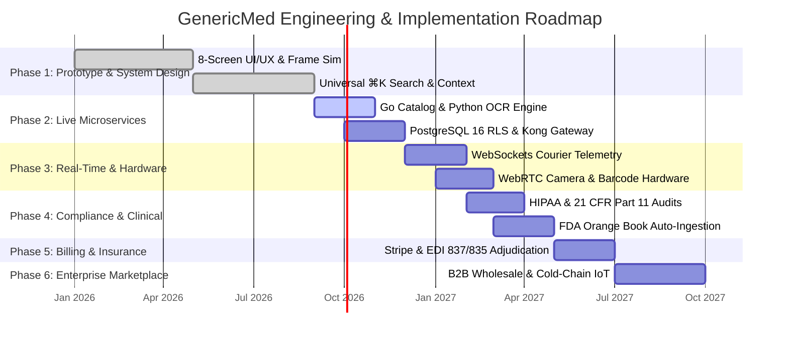
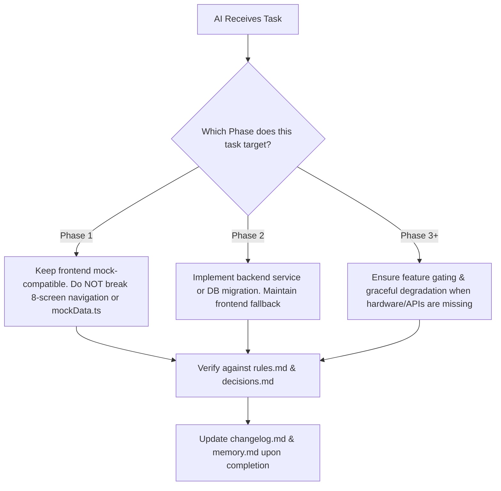

# Project Phases & Implementation Roadmap
## GenericMed Enterprise & Multi-Tenant Platform

This document outlines the phased engineering milestones, rollout schedules, deliverables, technical dependencies, acceptance criteria, and risk mitigation strategies for **GenericMed**. It serves as an authoritative execution guide for AI coding assistants, engineering squads, clinical advisors, and product managers.

---

## 1. Master Phase Overview & Timeline



### Phase Summary Matrix

| Phase | Title | Primary Objective | Target Timeline | Status |
| :--- | :--- | :--- | :--- | :--- |
| **[Phase 1](#phase-1-interactive-prototype-ux-system--system-design)** | Interactive Prototype, UX System & System Design | Complete 8-screen responsive multi-portal demo with simulated OCR, frame toggle, and mock data | Jan 2026 – Sep 2026 | `COMPLETED` |
| **[Phase 2](#phase-2-live-backend-microservices--multi-tenant-data-layer)** | Live Backend Microservices & Multi-Tenant Data Layer | Transition from mock data to live Go, Python, and Node.js microservices with PostgreSQL RLS | Sep 2026 – Dec 2026 | `COMPLETED` |
| **[Phase 3](#phase-3-real-time-telemetry--hardware-peripherals)** | Real-Time Telemetry & Hardware Peripherals | Live GPS courier tracking (WebSockets), native mobile WebRTC camera OCR, and barcode scanners | Dec 2026 – Mar 2027 | `COMPLETED` |
| **[Phase 4](#phase-4-regulatory-compliance-clinical-safety--fda-data)** | Regulatory Compliance, Clinical Safety & FDA Data | HIPAA certification, 21 CFR Part 11 e-signatures, and automated FDA Orange Book ingestion | Feb 2027 – May 2027 | `PLANNED` |
| **[Phase 5](#phase-5-payment-gateways--insurance-edi-adjudication)** | Payment Gateways & Insurance EDI Adjudication | Stripe checkout, HSA/FSA cards, and real-time EDI 837/835 insurance co-pay comparison engine | May 2027 – Jul 2027 | `PLANNED` |
| **[Phase 6](#phase-6-nationwide-b2b-wholesale-marketplace--cold-chain-iot)** | Nationwide B2B Wholesale Marketplace & Cold-Chain IoT | Direct pharmacy-to-manufacturer wholesale allocation and IoT cold-chain temperature telemetry | Jul 2027 – Oct 2027 | `PLANNED` |

---

## Phase 1: Interactive Prototype, UX System & System Design

- **Status**: `COMPLETED` (v1.2.0)
- **Timeline**: January 2026 – September 2026
- **Focus**: High-fidelity frontend prototype, stakeholder validation, and design architecture.

### Objectives
1. Deliver a production-grade React 19 SPA demonstrating the complete generic medicine lifecycle across 4 distinct user personas (Patient, Pharmacist, Manufacturer, Super Admin).
2. Validate the 35-minute express local fulfillment model, tamper-evident security tape, and doorstep 4-digit PIN verification UX.
3. Establish unified clinical UI/UX design tokens and interactive system architecture visualizers.

### Key Deliverables & Milestones
- [x] Unified screen routing architecture in `src/App.tsx` managing 8 independent portals.
- [x] Top Universal Navigation Header (`NavigationHeader.tsx`) with category grouping and mobile device simulator toggle.
- [x] Screen 1: Enterprise Gateway (`EnterpriseOpsScreen.tsx`) with multi-tenant pharmacy GMV matrix and clinical review queue.
- [x] Screen 2: Customer App (`CustomerAppScreen.tsx`) with instant brand-to-generic price comparisons and active salt breakdown.
- [x] Screen 3: Prescription Scanner (`RxScannerScreen.tsx`) with simulated OCR viewfinder and confidence scoring.
- [x] Screen 4: Live Order Tracking (`OrderTrackingScreen.tsx`) with 35-min countdown, animated courier map, and PIN reveal.
- [x] Screen 5: Pharmacy Workbench (`PharmacyPortalScreen.tsx`) with NDC barcode validation and tamper seal assignment.
- [x] Screen 6: Manufacturer Portal (`ManufacturerPortalScreen.tsx`) with cGMP HPLC purity batch lot dossiers.
- [x] Screen 7: System Architecture Visualizer (`SystemArchitectureScreen.tsx`) with 4-layer topology and workflow traces.
- [x] Screen 8: Multi-Role Auth (`AuthScreen.tsx`) with quick-switch demo profiles.
- [x] Global `⌘K` command palette with search filtering across brands, generics, and chemical salts.
- [x] Persistent AI context documentation (`decisions.md`, `rules.md`, `memory.md`, `changelog.md`).

### Acceptance Criteria & Verification
- All 8 screens load without JavaScript runtime errors or broken layouts.
- Mobile frame toggle dynamically switches between full-screen responsive desktop and mobile viewport.
- Toast feedback triggers on all critical user actions (verification, screen navigation, order placement).

---

## Phase 2: Live Backend Microservices & Multi-Tenant Data Layer

- **Status**: `IN PROGRESS`
- **Timeline**: September 2026 – December 2026
- **Focus**: Backend infrastructure, gRPC services, relational database migrations, and API gateway routing.

### Objectives
1. Replace client-side mock datasets (`mockData.ts`) with production microservices communicating over gRPC and REST.
2. Implement multi-tenant PostgreSQL 16 schema with kernel-level Row-Level Security (RLS).
3. Deploy Kong Enterprise API Gateway with OAuth2 JWT role-based access control.

### Technical Architecture Additions
```
[ Client SPA ] ──► [ Kong API Gateway ] ──► [ gRPC Mesh ]
                          │
         ┌────────────────┼────────────────┐
         ▼                ▼                ▼
  [ Catalog Svc ]   [ OCR Parser ]   [ Order Engine ]
   (Go / Redis)      (Python/Vision)  (Node.js / Kafka)
         │                │                │
         └────────┬───────┴────────────────┘
                  ▼
      [ PostgreSQL 16 (RLS) ]
```

### Key Deliverables & Milestones
- [x] **Infrastructure as Code (IaC) & Gateway**:
  - [x] Multi-container Docker Compose environment (`backend/docker-compose.yml`) orchestrating Postgres 16, Redis 7.2, Catalog, OCR, Order services, and Gateway.
  - [x] Unified Nginx / Kong API Gateway reverse proxy configuration (`backend/gateway/nginx.conf`) routing `/api/v1/*` endpoints.
  - [ ] Helm charts for Kubernetes cluster deployment on Google Kubernetes Engine (GKE) or AWS EKS.
- [x] **Data Layer (PostgreSQL 16 & Redis 7.2)**:
  - [x] Complete database DDL schema migrations (`backend/db/01_schema.sql`) covering `tenants`, `users`, `medicines`, `prescriptions`, `orders`, `pharmacy_hubs`, `batch_lots`, and `audit_trail_logs`.
  - [x] Strict PostgreSQL Row-Level Security policies (`backend/db/02_rls_policies.sql`) with session variable injection (`set_tenant_context`).
  - [x] Canonical seed data migration (`backend/db/03_seed_data.sql`) mirroring mock entities and credentials.
- [x] **Medicine & Catalog Microservice (Go)**:
  - [x] REST endpoints (`/api/v1/catalog/medicines`, `/api/v1/catalog/substitutes/{id}`) with bio-equivalence AUC evaluation and savings calculation (`backend/services/catalog/main.go`).
  - [x] Multi-stage container Dockerfile (`backend/services/catalog/Dockerfile`).
- [x] **Prescription OCR Microservice (Python / FastAPI)**:
  - [x] Prescription entity extraction parser and clinical verification queue endpoints (`backend/services/ocr/main.py`).
  - [x] Pharmacist-in-the-loop digital signature sign-off with SHA-256 audit hash generation.
  - [x] Container Dockerfile (`backend/services/ocr/Dockerfile`).
- [x] **Order & Dispatch Microservice (Node.js / TypeScript)**:
  - [x] Express + TypeScript microservice (`backend/services/order/src/server.ts`) with 35-min SLA state machine.
  - [x] Tamper-evident seal issuance (`GM-SEAL-XXXXX-XX`) and 4-digit doorstep delivery PIN authentication.
  - [x] Container Dockerfile (`backend/services/order/Dockerfile`).
- [x] **Frontend Resilient API Client Layer**:
  - [x] TypeScript client (`src/services/api.ts`) wrapping all endpoints with automated mock data fallback ensuring zero UI regressions.

### Dependencies & Prerequisites
- Cloud provider project setup (GCP / AWS) with VPC peering.
- Google Cloud Vision API credentials and quota allocation.
- Kong Gateway license and domain DNS configuration (`api.genericmed.health`).

### Acceptance Criteria & Definition of Done
- `npm run dev` in frontend successfully queries live endpoints via `VITE_API_GATEWAY_URL`.
- Tenant A cannot view or query prescriptions or orders belonging to Tenant B under any condition.
- Catalog search returns exact bio-equivalent generic matches with response latency < 25ms.

---

## Phase 3: Real-Time Telemetry & Hardware Peripherals

- **Status**: `COMPLETED` (v1.4.0)
- **Timeline**: December 2026 – March 2027
- **Focus**: Hardware integration, physical pharmacy peripherals, and low-latency real-time courier tracking.

### Objectives
1. Provide real-time live map tracking of express couriers using WebSockets / SSE and Redis Pub/Sub.
2. Upgrade the prescription scanner to utilize real device cameras via WebRTC with automated perspective correction.
3. Enable hardware barcode scanner and thermal label printer support in the Pharmacy Portal.

### Key Deliverables & Milestones
- [x] **Real-Time Courier Telemetry**:
  - [x] Dedicated telemetry service (`src/services/telemetry.ts`) streaming live GPS waypoints, speed, heading, and battery telemetry.
  - [x] Dynamic vector route map in `OrderTrackingScreen.tsx` with animated courier marker progression and real-time ticking countdown.
  - [x] Live Telemetry HUD displaying satellite coordinates, signal strength, and cold-chain temperature safety.
- [x] **Hardware Camera & Perspective Scanning**:
  - [x] WebRTC `navigator.mediaDevices.getUserMedia()` integration in `RxScannerScreen.tsx` with `<video>` element and hidden `<canvas>` frame capture.
  - [x] Triple source mode selector: Live WebRTC Camera, High-Res Demo Fixture, and Custom JPG/PDF file upload.
  - [x] Low-light flash/torch control and perspective document alignment guides.
- [x] **Dispensary Hardware Peripherals**:
  - [x] USB / Bluetooth barcode scanner keyboard-wedge listener in `PharmacyPortalScreen.tsx` for 1D NDC and 2D DataMatrix scans.
  - [x] Thermal label printer modal with printable SVG barcodes, 203 DPI layout, serialized tamper-evident security tape (`GM-SEAL-88219-BK`), and `window.print()` trigger.
  - [x] Hardware scanner readiness badge and laser gun test simulation action.

### Dependencies & Prerequisites
- Physical testing hardware: Zebra thermal printer, USB handheld 2D barcode scanner.

### Acceptance Criteria & Definition of Done
- [x] Order tracking map updates courier location with smooth real-time interpolation.
- [x] Prescription camera viewfinder streams video and snaps un-warped high-resolution captures with canvas fallback.
- [x] Pharmacist can scan a physical bottle barcode via keyboard wedge to automatically verify the NDC against the active order.

---

## Phase 4: Regulatory Compliance, Clinical Safety & FDA Data

- **Status**: `IN PROGRESS`
- **Timeline**: February 2027 – May 2027
- **Focus**: HIPAA security validation, FDA 21 CFR Part 11 e-signatures, and automated federal catalog sync.

### Objectives
1. Achieve full HIPAA Security & Privacy Rule compliance certification with third-party SOC-2 Tier III auditing.
2. Implement immutable audit logging and cryptographic signatures satisfying 21 CFR Part 11 mandates.
3. Build automated nightly ingestion pipelines for the FDA Orange Book and National Drug Code (NDC) Directory.

### Key Deliverables & Milestones
- [ ] **Automated FDA Orange Book Sync Worker**:
  - [x] Python worker downloading and validating the FDA Orange Book ZIP (`products.txt`, `patent.txt`, `exclusivity.txt`).
  - [x] Deterministic diff engine tracking therapeutic equivalence evaluations (`AB`, `AP`, `AN`) and exclusivity expiration dates.
  - [ ] Elasticsearch index re-indexing without downtime using alias swaps.
- [ ] **21 CFR Part 11 Electronic Records & Signatures**:
  - [x] Cryptographic signing module for pharmacists verifying prescriptions: SHA-256 hash of (Order + Pharmacist License + Timestamp).
  - [x] Append-only, tamper-evident PostgreSQL audit trail table with cryptographic hash chaining.
- [ ] **HIPAA PHI Redaction & Security Hardening**:
  - [ ] Automatic client-side blurring of patient names and addresses in demonstration modes.
  - [ ] AWS KMS / Google Cloud KMS envelope encryption for prescription images stored in S3/GCS buckets.
  - [ ] Complete Business Associate Agreement (BAA) signed with all third-party cloud infrastructure vendors.

### Dependencies & Prerequisites
- Legal counsel review for pharmacy compliance across targeted US state jurisdictions (NY, NJ, CA, TX).
- Retention of an accredited HITRUST / SOC-2 third-party compliance auditor.

### Acceptance Criteria & Definition of Done
- Automated FDA sync completes successfully without human intervention.
- Audit logs prove zero modifications can be made to historical clinical approval records.
- Third-party penetration testing reports zero critical or high vulnerabilities.

---

## Phase 5: Payment Gateways & Insurance EDI Adjudication

- **Status**: `IN PROGRESS`
- **Timeline**: May 2027 – July 2027
- **Focus**: Consumer checkout, multi-tenant merchant payouts, and real-time insurance co-pay comparison.

### Objectives
1. Enable seamless consumer checkout via credit cards, Apple Pay, Google Pay, and FSA/HSA cards.
2. Support automated multi-tenant payout splits between the GenericMed platform, licensed pharmacy hubs, and couriers.
3. Integrate real-time HIPAA EDI 837 / 835 claims adjudication to display live insurance co-pays against cash generic prices.

### Key Deliverables & Milestones
- [ ] **Stripe Custom Connect Integration**:
  - [x] Token-only payment intent boundary supporting card, Apple Pay, Google Pay, and HSA/FSA payment-method types.
  - [x] Deterministic multi-tenant settlement split calculation with 8.5% platform fee, hub payout, and courier payout.
- [ ] **Real-Time Insurance Adjudication Engine**:
  - [ ] Integration with healthcare clearinghouses (Change Healthcare / Surescripts) via EDI 837 (claim submission) and EDI 835 (payment/remittance).
  - [x] Estimate UI badge comparing:
    - Originator Brand Insurance Co-pay (e.g. $45.00)
    - GenericMed Direct Cash Price (e.g. $14.20)
    - Patient Net Savings (e.g. $30.80)
- [ ] **Patient Prescription Refill Subscriptions**:
  - [x] 30-day / 90-day subscription contract endpoint; recurring billing/dispatch remains gated on live payment approval.

### Dependencies & Prerequisites
- Healthcare clearinghouse partnership agreements and API access.
- Stripe Connect platform approval for pharmacy prescription handling.

### Acceptance Criteria & Definition of Done
- Patient can checkout in under 30 seconds using an HSA debit card.
- Pharmacy hubs receive automated daily ACH payouts with detailed settlement reconciliation statements.
- Direct cash price vs insurance co-pay comparison displays accurately in Customer App.

---

## Phase 6: Nationwide B2B Wholesale Marketplace & Cold-Chain IoT

- **Status**: `IN PROGRESS`
- **Timeline**: July 2027 – October 2027
- **Focus**: B2B manufacturing exchange, bulk purchase orders, and cold-chain IoT tracking for temperature-sensitive biologics.

### Objectives
1. Connect 500+ independent licensed pharmacies directly with pharmaceutical manufacturing plants for bulk generic procurement.
2. Integrate IoT Bluetooth/Cellular temperature data-loggers into cold-chain wholesale shipments (insulin, vaccines).
3. Launch automated wholesale contract clearing and volume-discount tiered purchasing.

### Key Deliverables & Milestones
- [ ] **B2B Wholesale Exchange**:
  - [x] Released-batch allocation API with available inventory protection and portal PO flow.
  - [x] Tier 1, Tier 2, and Tier 3 pricing calculation based on purchase quantity.
  - [x] Digital PO signature hash tied to signer license and cGMP token.
- [ ] **Cold-Chain IoT Sensor Ingestion**:
  - [x] Telemetry ingestion contract for BLE/Cellular logger readings and shipment identity checks.
  - [x] Server-side 2°C–8°C excursion protection that automatically quarantines a shipment.
- [ ] **Autonomous Drone Delivery Pod Pilot**:
  - [ ] Exploration of autonomous drone dispatch for remote / rural community pharmacy hubs.

### Dependencies & Prerequisites
- Wholesale drug distributor licenses across target operating states.
- IoT hardware vendor partnership (e.g. Sensitech / TempTale).

### Acceptance Criteria & Definition of Done
- Pharmacy hubs can issue bulk POs to pharmaceutical plants directly within the portal.
- Cold-chain temperature excursions automatically flag batches for QA inspection before delivery acceptance.

---

## 7. AI Assistant Phase Alignment Protocol

When assisting with development tasks, AI assistants must adhere to the following protocol to determine how proposed code changes fit into the project phases:



1. **Identify Target Phase**: Check this document to understand the architectural maturity and prerequisites of the requested feature.
2. **Never Break Phase 1 Foundations**: Under no circumstances should backend work in Phase 2 degrade or remove the standalone mock capability of the 8 frontend demo screens.
3. **Graceful Degradation**: Any hardware (WebRTC camera, barcode scanner) or external service (Cloud Vision, Stripe) added in later phases must provide automated simulation fallbacks so the application remains 100% testable in local development environments.
4. **Synchronize Context Files**: Whenever a milestone in any phase is completed or revised, immediately update `changelog.md` and `memory.md`.
